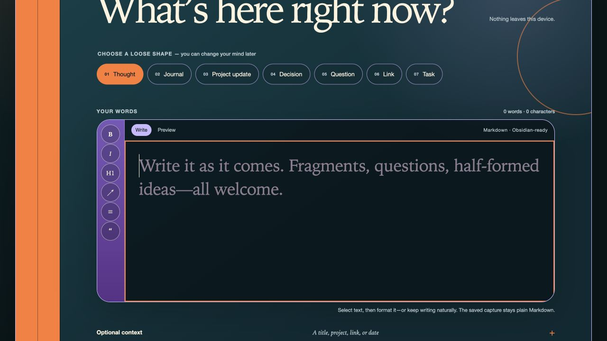
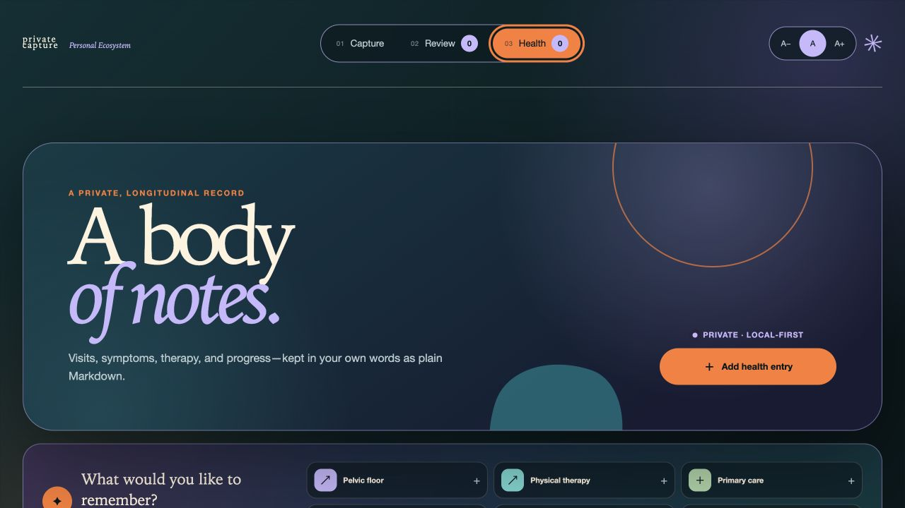

# Private Capture

[](https://github.com/shivanigupta-dev/private-capture-md/actions/workflows/ci.yml)
[](LICENSE)
[](PRIVACY.md)

Private Capture is a calm, local-first writing surface for getting thoughts out of your head without opening a full notes app.

Each entry is saved as an ordinary `.md` file inside a folder you explicitly approve. Keep it in Obsidian, sync it with tools you already use, open it in any text editor, or leave it entirely on one device—the files stay yours either way.

No account. No database. No analytics. No AI features or external model calls. The default setup stays on your computer.



> **Early alpha and development disclosure:** Private Capture is a vibe-coded project built with AI-assisted development tools and maintained by Shivani Gupta. Its file-safety model is implemented and tested, but it has not had an independent security review. Review the code, keep backups, and read the threat model before trusting it with sensitive data or network access.

## What it is

- A focused capture screen with lightweight Markdown formatting and preview
- A private Health Journal for visits, symptoms, therapy, preventive care, and follow-up dates
- A private inbox made of plain files you own
- A review view that records suggestions separately and never rewrites a capture
- A local desktop tool by default
- An installable web app when served over HTTPS
- Optionally self-hostable on an always-on Linux machine or home server

Private Capture is not a full vault editor, a sync engine, or an Obsidian plugin. It deliberately writes only inside the folder you approve.

The Health Journal is a personal organizational record—not a medical device, patient portal, diagnostic tool, or emergency record. Read [Health data and safety](docs/health-data.md) before using it for sensitive information.



## Choose the setup that fits

| You want to… | Use… | Always-on server? |
| --- | --- | --- |
| Capture on the computer that holds your vault | Local mode | No |
| Keep the capture folder in Google Drive, Dropbox, OneDrive, or Syncthing | Local mode + a mirrored/offline folder | No |
| Capture from your phone while your computer is on | Token mode + HTTPS on a private LAN or VPN | No, but the computer must be awake |
| Capture from your phone without relying on your laptop | Linux + HTTPS + a private VPN | Yes |
| Use Obsidian Sync on a server | Linux + Obsidian Headless | Yes, and an Obsidian Sync subscription |

The server is an option, not the product's assumption. A local background process and an internet-facing service are very different risk profiles; the documentation keeps them separate.

## Quick start

Private Capture currently requires Node.js 24.12 or newer and has no package dependencies. The repository pins Node.js 24.14 for contributors.

Clone the repository, then run:

```bash
git clone https://github.com/shivanigupta-dev/private-capture-md.git
cd private-capture-md
node src/cli/main.ts init --vault "/path/to/your/Obsidian vault"
node src/cli/main.ts serve
```

Open `http://127.0.0.1:3217`.

The `init` command creates a new `Private Capture/` folder inside the selected vault. It will not adopt a non-empty folder, touch `.obsidian`, or claim the rest of the vault. Machine-specific configuration is stored outside the vault.

To inspect the connection without writing anything:

```bash
node src/cli/main.ts doctor
```

## Your files

```text
Private Capture/
├── .private-capture-root.json
└── Inbox/
    ├── Captures/
    │   ├── 2026-07-21--a-thought--4dd4a1f2.md
    │   ├── 2026-07-21--health--therapy-session--r1--….md
    │   └── 2026-07-21--health--therapy-session--r2--….md
    └── _review/
        └── cap_…--2026-07-21T18-42-03-000Z--….json
```

Captures and Health Journal entries are append-only. Editing a health entry creates a new Markdown revision, and the timeline shows the latest revision while preserving the earlier file. Review proposals are separate append-only JSON sidecars. Removing or changing the approval marker pauses all reads and writes.

The Health Journal includes 17 built-in, centrally defined categories plus custom categories. Its guided fields adapt to the selected entry type; optional measurements stay optional. Search and filters run inside the browser, so private search text is not sent in URLs or server logs. The journal records what you enter and does not diagnose conditions or provide medical advice.

## Sync

Private Capture does not invent a second sync system. Point it at a locally available folder and let the sync tool you already trust move the files.

- [Google Drive, Dropbox, OneDrive, iCloud, and Syncthing](docs/sync.md)
- [Obsidian CLI and Obsidian Headless](docs/obsidian.md)
- [Optional Linux + VPN deployment](docs/self-hosting.md)
- [What the app stores and does not collect](PRIVACY.md)

Sync is not a backup. Keep versioned backups separately.

## Principles

1. Plain files are the source of truth.
2. A capture is never silently replaced.
3. The app receives the smallest useful folder permission.
4. Network access is opt-in and requires authentication plus HTTPS.
5. Personal data does not enter logs, telemetry, screenshots, or fixtures.
6. A useful offline path is better than a fragile cloud dependency.
7. Health records remain private, user-owned notes rather than medical advice.

See [Architecture](docs/architecture.md) and [Threat model](docs/threat-model.md) for the less friendly details.

The current release plan lives in the [roadmap](docs/roadmap.md).

## Contributing

Small, legible changes are welcome. Please read [CONTRIBUTING.md](CONTRIBUTING.md) before opening a pull request. Security issues should be reported privately as described in [SECURITY.md](SECURITY.md).

Private Capture is an independent project and is not affiliated with or endorsed by Obsidian.
