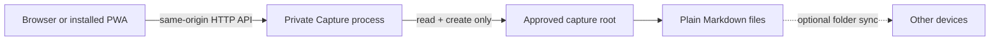

# Architecture

Private Capture is a file writer with a web interface. The short version is intentionally boring:



## Trust boundary

The app does not receive a vault-wide permission. `init` creates a new bounded folder and an immutable approval marker. Machine-local configuration pins both the marker fingerprint and its random root identity.

The marker grants exactly four capabilities:

| Path | Read | Create | Replace | Delete |
| --- | ---: | ---: | ---: | ---: |
| `Inbox/Captures/*.md` (captures and health-event revisions) | Yes | Yes | No | No |
| `Inbox/_review/*.json` | Yes | Yes | No | No |

Everything outside the approved root is non-application-owned. `.obsidian` is rejected explicitly.

The marker is verified at startup and again before each file operation. A missing, malformed, changed, or replaced marker pauses the app. Symlinked roots, markers, parent directories, and records are rejected.

## Durable writes

New records are written to a restrictive temporary file, flushed to disk, and atomically linked into their final name with no-overwrite semantics. The containing directory is then flushed where the operating system supports it.

Capture IDs are derived from a client-generated idempotency key. Retrying the same request returns the existing receipt; reusing the key for different content returns a conflict. The server serializes its own writes so simultaneous retries cannot produce two names for one capture.

Review is append-only too. Each new proposal receives a unique sidecar file. The capture's SHA-256 must still match the version shown to the reviewer.

## Data format

A capture is Markdown with deliberately simple YAML-compatible properties:

```markdown
---
type: "capture"
id: "cap_4dd4a1f2-9cf3-44cb-a473-3c083b78cf8a"
schema_version: 1
created_at: "2026-07-21T18:42:03.000Z"
updated_at: "2026-07-21T18:42:03.000Z"
saved_at: "2026-07-21T18:42:03.214Z"
owner: "private-capture"
privacy: "private"
title: "A thought"
capture_type: "thought"
state: "inbox"
---
The body is preserved exactly as submitted.
```

Health entries use the same bounded Markdown directory and a separate `type: "health-event"`, `schema_version: 1` record shape. Every logical event has a stable `event_id`; later edits receive a new record ID, increment `revision`, and point to the previous record with `revises`. The API collapses those immutable files into the latest timeline entry and reports the revision count. The central category registry supplies all built-in labels, groups, colors, and adaptive field definitions; custom category slugs and labels are stored with the event.

The schema avoids Obsidian-only syntax. Obsidian is a useful reader, not a required runtime. There is no database and therefore no database migration; the versioned Markdown schema is the migration boundary.

## Browser application

The web app is plain HTML, CSS, and JavaScript. The service worker caches only the application shell. It never caches API responses, access tokens, captures, or review data.

Draft recovery uses session storage, so capture and health drafts stay in the current browser tab and disappear when that tab's session is discarded. Capture and Health Journal searches and filters are evaluated client-side and are never placed in URL query parameters. Font size is a device-local preference. The access token is exchanged for an in-memory, HTTP-only session cookie and is not written to browser storage.

## API

The first API version is intentionally small:

- `POST /api/v1/session`
- `GET /api/v1/health`
- `GET /api/v1/captures`
- `POST /api/v1/captures`
- `POST /api/v1/reviews`
- `GET /api/v1/health-journal/meta`
- `GET /api/v1/health-events`
- `POST /api/v1/health-events`
- `POST /api/v1/health-events/:event_id/revisions`

Network mode adds token authentication, strict same-origin checks, request-size limits, and basic rate limiting. HTTPS is still required outside localhost.
